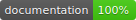

# MyApp

MyApp is a sample app to get you started on iOS.

# Features
* Continuous integration with Jenkins
* Crashlytics integration for reporting & monitoring
* Fabric for deployment, monitoring, & user metrics
* Carthage for dependencies
* Localization for multi-language support
* Fastlane for deployment
* Jazzy for documentation
* Slather for test coverage reporting
* Swiftlint for keeping sources tidy
* MORE

# Documentation

